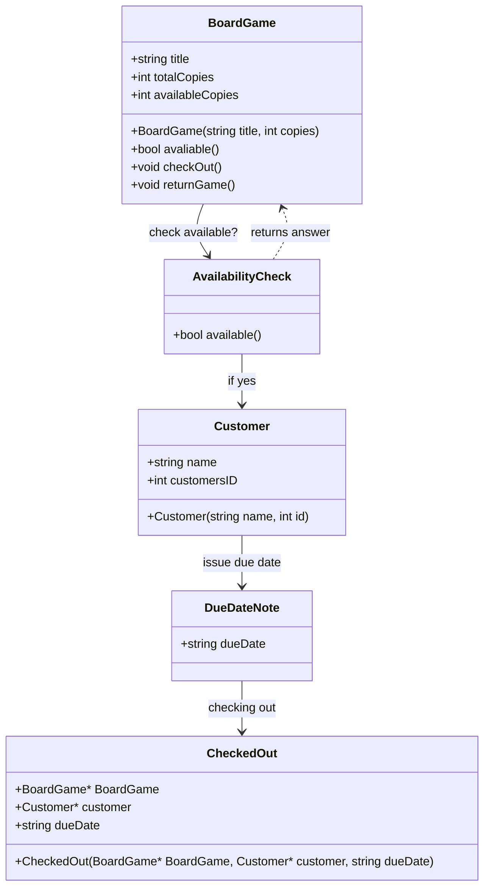

markdown file thing

This program is designed to help manage board games for a board game café. Keeps track of what games are available, how many copies exist, and which customers have borrowed them. The system can check out games to customers, track when they’re returned, and store basic info about who has what and when it’s due back. 

Nouns:
what type of boardGame
what is checkedOut
Title of thing
TotalCopies i have (stock purpose)
AvailableCopies
Customer Name
ID
DueDate

Verbs:
is it checkOut 
is it returnGame
isAvailable
manage lending(keeping track)
track borrowed items

mermaid

